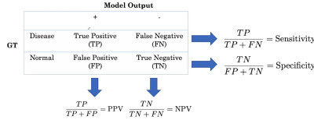

# Course 1: [AI for Medical Diagnosis](https://www.coursera.org/learn/ai-for-medical-diagnosis)

## 1.1. Welcome to the AI for Medicine Specialization

## 1.2. Applications of computer vision to medical diagnosis 

## 1.3. How to handle class imbalance and small training sets

- 3 Key challenges
  - Class imbalance
  - Multi-task
  - Dataset size

- Binary cross-entropy loss
$$L(X, y) =  \begin{cases}
    \log P(Y=1|X) \quad \text{if } y = 1\\
    \log P(Y=0|X) \quad \text{if } y = 0
\end{cases}$$

- Weighted loss
  - Let $w_p=\dfrac{\text{num negative}}{\text{num total}}$, and $w_p=\dfrac{\text{num positive}}{\text{num total}}$, and the weighted loss becomes the following

$$L(X, y) =  \begin{cases}
    w_p \times \log P(Y=1|X) \quad \text{if } y = 1\\
    w_n \times \log P(Y=0|X) \quad \text{if } y = 0
\end{cases}$$

- Another way to tackle the class imbalance problem is to use resampling.

- Multi-label / multi-task loss, 
  - e.g., $L(X, y_{\text{mass}}) + L(X, y_{\text{pneumonia}}) + L(X, y_{\text{edema}})$
  - Weighted multi-task loss function
$$L(X, y_{\text{mass}}) =  \begin{cases}
    w_{p, \text{ mass}} \times \log P(Y_{\text{mass}}=1|X) \quad \text{if } y_{\text{mass}} = 1\\
    w_{n, \text{ mass}} \times \log P(Y_{\text{mass}}=0|X) \quad \text{if } y_{\text{mass}} = 0
\end{cases}$$

- Convolutional neural networks (CNN)  architectures
  - Inception-v3
  - ResNet-34
  - [DenseNet](https://arxiv.org/pdf/1608.06993.pdf)
  - ResNeXt
  - EfficientNet

- Dataset size problem
  - Use pre-trained CNN and fine-tune deeper layers
  - Generate more samples using data augmentation

## 1.4. Check how well your model performs
- Training/validation/test set or training (cross-validation)/test set
- 3 challenges for medical images
  - Patient overlap
    - If multiple data points belong to the same patient, split them into training and test set can lead to over-optimistic test set performance.
    - *Solution*: split data by patient.
  - Set sampling 
    - When sample size is small, we can construct the test set such that at least X% (e.g., 50%) minority class is sampled.
    - Once the test sample is created, we create the validation set next and make it have the same distribution of classes as the test set.
    - Remaining patients in training set.
    - *Solution*: minority class sampling
  - Ground truth / reference standard (in medicine)
    - *Solution*: Consensus voting (in the presence of inter-observer disagreement) or use additional and more definitive medical testing to determine ground-truth.

## 1.5. Key evaluation metrics

- Accuracy
  - Accuracy can be decomposed as follows
  
  $$\text{Accuracy} = P(\text{correct}|\text{disease})\cdot P(\text{disease}) + P(\text{correct}|\text{normal})\cdot P(\text{normal})$$

  - In the presence of class imbalance, accuracy can be dominated by the majority class even though the minority could be what we really care about.

- Sensitivity and Specificity
  - Sensitivity = predict + given disease
  - Specificity = predict - given normal
  - Probability of disease if called *prevalence*
  - Accuracy = Sensitivity $\times$ prevalence + Specificity $\times$ (1 - prevalence)  

- PPV and NPV
  - PPV (positive predictive value) = $P(\text{disease }|+)$
  - NPV (negative predictive value) = $P(\text{normal }|-)$
  - PPV rewritten
    $$PPV = \dfrac{\text{sensitivity}\times\text{prevalence}}{\text{sensitivity}\times\text{prevalence}+(1-\text{specificity})\times(1-\text{prevalence})}$$

- Confusion matrix

  

## 1.6. How does varying the threshold affect evaluation metrics?

- ROC curve
  - Sensitivity versus specificity

## 1.7. Interpreting confidence intervals correctly
- Interpretation
  - e.g., with 95% confidence (not 95% probability), $p$ is in the interval [0.72, 0.88]
  - In repeated sampling, the method produces intervals that include the population accuracy in about 95% of samples.
- Use bootstrap to calculate empirical CIs.