Lecture notes for the [AI For Medicine specialization](https://www.deeplearning.ai/ai-for-medicine/) offered by [deeplearning.ai](https://www.deeplearning.ai/).

- [Course 1: AI for Medical Diagnosis](#course-1-ai-for-medical-diagnosis)
  - [1.1. Disease detection with computer vision](#11-disease-detection-with-computer-vision)
    - [1.1.1. Applications of computer vision to medical diagnosis](#111-applications-of-computer-vision-to-medical-diagnosis)
    - [1.1.2. How to handle class imbalance and small training sets](#112-how-to-handle-class-imbalance-and-small-training-sets)
    - [1.1.3. Check how well your model performs](#113-check-how-well-your-model-performs)
  - [1.2. Evaluating models](#12-evaluating-models)
    - [1.2.1. Key evaluation metrics](#121-key-evaluation-metrics)
    - [1.2.2. How does varying the threshold affect evaluation metrics?](#122-how-does-varying-the-threshold-affect-evaluation-metrics)
    - [1.2.3. Interpreting confidence intervals correctly](#123-interpreting-confidence-intervals-correctly)
  - [1.3. Image segmentation on MRI images](#13-image-segmentation-on-mri-images)
    - [1.3.1. MRI data](#131-mri-data)
    - [1.3.2 Image segmentation](#132-image-segmentation)
    - [1.3.3 Practical considerations](#133-practical-considerations)
- [Course 2: AI for Medical Prognosis](#course-2-ai-for-medical-prognosis)
  - [2.1. Linear prognostic models](#21-linear-prognostic-models)
    - [2.1.1. Prognosis and risk](#211-prognosis-and-risk)
    - [2.1.2. Prognostic models in medical practice](#212-prognostic-models-in-medical-practice)
    - [2.1.3. Representing feature interactions](#213-representing-feature-interactions)
    - [2.1.4. Evaluating prognostic models](#214-evaluating-prognostic-models)
  - [2.2. Prognosis with Tree-based models](#22-prognosis-with-tree-based-models)
    - [2.2.1. Tree-based models](#221-tree-based-models)
    - [2.2.2. Identifying missing data](#222-identifying-missing-data)
    - [2.2.3. Using imputation to handle missing data](#223-using-imputation-to-handle-missing-data)
  - [2.3. Survival models](#23-survival-models)
    - [2.3.1. Survival estimates](#231-survival-estimates)
    - [2.3.2. Time to event data](#232-time-to-event-data)
    - [2.3.3. Estimate survival with censored data](#233-estimate-survival-with-censored-data)
  - [2.4. Building a risk model using linear and tree-based models](#24-building-a-risk-model-using-linear-and-tree-based-models)
    - [2.4.1. Survival and hazard functions](#241-survival-and-hazard-functions)
    - [2.4.2. Customizing risk models to individual patients](#242-customizing-risk-models-to-individual-patients)
    - [2.4.3. Non-linear risk models with survival trees](#243-non-linear-risk-models-with-survival-trees)
    - [2.4.4. Evaluate survival models](#244-evaluate-survival-models)
- [Course 3: AI for Medical Treatment](#course-3-ai-for-medical-treatment)
  - [3.1. Treatment Effect Estimation](#31-treatment-effect-estimation)
    - [3.1.1. Randomized Control Trials (RCT)](#311-randomized-control-trials-rct)
    - [3.1.2. Average Treatment Effect](#312-average-treatment-effect)
    - [3.1.3. Individualized Treatment Effect](#313-individualized-treatment-effect)
  - [3.2. Medical Question Answering](#32-medical-question-answering)
    - [3.2.1. Question Answering](#321-question-answering)
    - [3.2.2. Automatic Labeling](#322-automatic-labeling)
    - [3.2.3. Evaluate Automatic Labeling](#323-evaluate-automatic-labeling)
  - [3.3. ML Interpretation](#33-ml-interpretation)
    - [3.3.1. Feature Importance](#331-feature-importance)
    - [3.3.2. Individual Feature Importance](#332-individual-feature-importance)
    - [3.3.3. Interpreting Deep Learning Models](#333-interpreting-deep-learning-models)
  - [3.4. Citations](#34-citations)

# Course 1: [AI for Medical Diagnosis](https://www.coursera.org/learn/ai-for-medical-diagnosis)

## 1.1. Disease detection with computer vision

### 1.1.1. Applications of computer vision to medical diagnosis 
- Examples of medical image diagnosis tasks where deep learning algorithms have achieved performance measures comparable to human
  - Dermatology: detecting cancerous skin tissues
  - Ophthalmology: diabetic retinopathy (DR) detection
  - Histopathology: determine cancer spread to Lymph nodes from whole-slide image.

### 1.1.2. How to handle class imbalance and small training sets

- 3 Key challenges
  - Class imbalance
  - Multi-task
  - Dataset size

- Binary cross-entropy loss
$$L(X, y) =  \begin{cases}
    \log P(Y=1|X) \quad \text{if } y = 1\\
    \log P(Y=0|X) \quad \text{if } y = 0
\end{cases}$$

- Weighted loss
  - Let $w_p=\dfrac{\text{num negative}}{\text{num total}}$, and $w_p=\dfrac{\text{num positive}}{\text{num total}}$, and the weighted loss becomes the following

$$L(X, y) =  \begin{cases}
    w_p \times \log P(Y=1|X) \quad \text{if } y = 1\\
    w_n \times \log P(Y=0|X) \quad \text{if } y = 0
\end{cases}$$

- Another way to tackle the class imbalance problem is to use resampling.

- Multi-label / multi-task loss, 
  - e.g., $L(X, y_{\text{mass}}) + L(X, y_{\text{pneumonia}}) + L(X, y_{\text{edema}})$
  - Weighted multi-task loss function
$$L(X, y_{\text{mass}}) =  \begin{cases}
    w_{p, \text{ mass}} \times \log P(Y_{\text{mass}}=1|X) \quad \text{if } y_{\text{mass}} = 1\\
    w_{n, \text{ mass}} \times \log P(Y_{\text{mass}}=0|X) \quad \text{if } y_{\text{mass}} = 0
\end{cases}$$

- Convolutional neural networks (CNN)  architectures
  - Inception-v3
  - ResNet-34
  - [DenseNet](https://arxiv.org/pdf/1608.06993.pdf)
  - ResNeXt
  - EfficientNet

- Dataset size problem
  - Use pre-trained CNN and fine-tune deeper layers
  - Generate more samples using data augmentation

### 1.1.3. Check how well your model performs
- Training/validation/test set or training (cross-validation)/test set
- 3 challenges for medical images
  - Patient overlap
    - If multiple data points belong to the same patient, split them into training and test set can lead to over-optimistic test set performance.
    - *Solution*: split data by patient.
  - Set sampling 
    - When sample size is small, we can construct the test set such that at least X% (e.g., 50%) minority class is sampled.
    - Once the test sample is created, we create the validation set next and make it have the same distribution of classes as the test set.
    - Remaining patients in training set.
    - *Solution*: minority class sampling
  - Ground truth / reference standard (in medicine)
    - *Solution*: Consensus voting (in the presence of inter-observer disagreement) or use additional and more definitive medical testing to determine ground-truth.

## 1.2. Evaluating models

### 1.2.1. Key evaluation metrics

- Accuracy
  - Accuracy can be decomposed as follows
  
  $$\text{Accuracy} = P(\text{correct}|\text{disease})\cdot P(\text{disease}) + P(\text{correct}|\text{normal})\cdot P(\text{normal})$$

  - In the presence of class imbalance, accuracy can be dominated by the majority class even though the minority could be what we really care about.

- Sensitivity and Specificity
  - Sensitivity = predict + given disease
  - Specificity = predict - given normal
  - Probability of disease if called *prevalence*
  - Accuracy = Sensitivity $\times$ prevalence + Specificity $\times$ (1 - prevalence)  

- PPV and NPV
  - PPV (positive predictive value) = $P(\text{disease }|+)$
  - NPV (negative predictive value) = $P(\text{normal }|-)$
  - PPV rewritten
    $$PPV = \dfrac{\text{sensitivity}\times\text{prevalence}}{\text{sensitivity}\times\text{prevalence}+(1-\text{specificity})\times(1-\text{prevalence})}$$

- Confusion matrix

  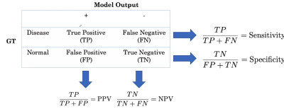

### 1.2.2. How does varying the threshold affect evaluation metrics?

- ROC curve
  - Sensitivity versus specificity

### 1.2.3. Interpreting confidence intervals correctly
- Interpretation
  - e.g., with 95% confidence (not 95% probability), $p$ is in the interval [0.72, 0.88]
  - In repeated sampling, the method produces intervals that include the population accuracy in about 95% of samples.
- Use bootstrap to calculate empirical CIs.

## 1.3. Image segmentation on MRI images

### 1.3.1. MRI data 
- MRI example consists of multiple imaging [sequences](https://en.wikipedia.org/wiki/MRI_sequence), which can be combined by treating them as different channels.
- When sequences have misalignment, a preprocessing technique [image registration](https://en.wikipedia.org/wiki/Image_registration) can be applied.

### 1.3.2 Image segmentation
- 2D versus 3D approach
  - 2D approach doesn't consider similarities between adjacent slices (temporal information).
  - 3D approach requires splitting the image slices into blocks / sub-volumes (for computation and memory reason), which preserves temporal information but losses spatial information.

- U-Net
  - [2D U-Net](https://arxiv.org/abs/1505.04597) architecture
  
  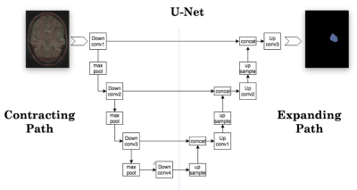

  - [3D U-Net](https://arxiv.org/abs/1606.06650) architecture, replace 2D operations with 3D counterparts.
  
  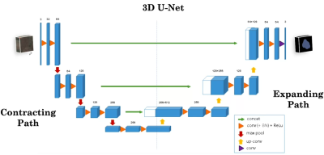

  - See [reading notes](reading_notes.md##u-net-convolutional-networks-for-biomedical-image-segmentation) on U-Net.

- Data augmentation for segmentation
  - Also need to transform (e.g., rotation, deformation) output segmentation
  - Apply to the 3-D volume
- Loss function for image segmentation
  - Pixel-wise probability estimation
  - *Soft Dice Loss*
  
    $$L(P,G)=1-\frac{2\sum_i^np_ig_i}{\sum_i^np_i^2+\sum_i^ng_i^2}$$ 
    
    where $P$ is the pixel-wise prediction output, $G$ is the ground truth binary labels.
    - Note that the second term is a measure of overlap between $P$ and $G$.

### 1.3.3 Practical considerations
- Different populations and diagnostic technology are challenges for generalization.
- External validation
  - In real-world applications where new population is different from the original population on which the model is developed, we can construct new training/validation/test set and fine-tune the original model.
  - If prospective data is fundamentally different than the retrospective data (e.g., frontal versus lateral chest X-rays), we need to either filter out some of the new data or fine-tune the model.
- Measuring patient outcomes
  - Decision curve analysis
  - Randomized controlled trials
  - Model interpretation

# Course 2: [AI for Medical Prognosis](https://www.coursera.org/learn/ai-for-medical-prognosis)

## 2.1. Linear prognostic models

### 2.1.1. Prognosis and risk

- [Prognosis](https://en.wikipedia.org/wiki/Prognosis) is a medical term that refers to predicting the likelihood or expected development of a disease. 
- Essentially it's a task of predicting risk of a future event.
- Prognosis is useful for
  - Informing patients of their risk of  illness, and survival with illness.
  - Guiding treatment, e.g.,
    - Risk of heart attack $\rightarrow$ Who should get drugs 
    - 6-month mortality risk $\rightarrow$ Who should receive end-of-life care. 

### 2.1.2. Prognostic models in medical practice
- Prognostic model scheme

  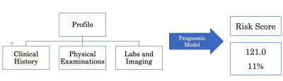

- Examples
  - Use chads vasc score to predict 1-year risk of stroke for patients with *atrial fibrillation*.
  - Use model for end-stage *liver disease* (MELD) score to estimate 3-month mortality for patients $\geq 12$ of age on liver transplant waiting lists.
  - Use ASCVD Risk Estimator Plus to predict 10-year *risk of heart disease* for patients 20 or older without heart disease.

### 2.1.3. Representing feature interactions
- Risk equation without interaction, e.g.,
    $$\text{Score} = \ln \text{Age} \times \text{coefficient}_{Age} + \log BP \times \text{coefficient}_{BP}$$
- The same equation with interaction terms
  $$\text{Score} = \ln \text{Age} \times \text{coefficient}_{Age} + \log BP \times \text{coefficient}_{BP} + \ln \text{Age}\times \log BP \times \text{coefficient}_{Age, BP}$$
- The interaction term captures the interdependence of feature effects to the risk, as shown in the figure below (left is without interaction, right is with interaction term)

  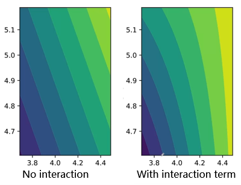

### 2.1.4. Evaluating prognostic models
- Good risk model should give patient of positive class (e.g., died within 10 years) a higher score than patient of negative class.
- Terminology for pairs
  - For a pair of two patients, if the patient of worse condition has a higher score, then the pair is called **concordant**.
  - If the patient of worse condition has a lower score, the pair is **non-concordant**.
  - If the pair has the same risk scores, it's called **risk ties** regardless of their outcome.
  - If the pair has the same outcome, it's called **ties in outcome** regardless of their risk scores.
  - **Permissible** pairs are pairs with different outcomes.
- Evaluation of prognostic models
  - +1 for a permissible pair that is concordant.
  - +0.5 for a permissible pair for risk time.
- C-Index (AKA *concordance index*)
  - Definition
  $$\text{C-index}=\dfrac{\# \text{ concordant pairs} + 0.5\times\#\text{ risk ties}}{\# \text{ permissible pairs}}$$
  - Interpretation
    - C-index can be interpreted as $P(\text{score}(A) > \text{score}(B)|Y_A > Y_B)$, where random model score = 0.5, and perfect model score = 1.0. 
  - C-index versus AUC
    - Quote the [documentation](https://square.github.io/pysurvival/metrics/c_index.html) of the `PySurvival` package, "*the C-index is a generalization of the area under the ROC curve (AUC) that can take into account censored data. It represents the global assessment of the model discrimination power: this is the model’s ability to correctly provide a reliable ranking of the survival times based on the individual risk scores*".

## 2.2. Prognosis with Tree-based models

- Key concepts
  - Identify missing data.
  - Tune a decision tree’s hyperparameters based on its c-index.
  - Tune a random forest’s hyperparameters based on its c-index.
  - Use visual inspection to identify differences in distribution due to missing data.
  - Use mean imputation and regression imputation to fill in missing data.
  - Use Shapley Additive Explanations (SHAP) to quantify the importance of each feature to a random forest model’s predictions.

### 2.2.1. Tree-based models
- Linear models find hyperplanes to split the feature space. 
- Tree-based models are able to split the feature space into regions. 
  - Their structures can be represented by a series of "if-then" questions.
  - Decision tree can model non-linear associations.
- There are a variety of variables to select feature/value to split on for building a decision tree.
- Control the complexity of the decision tree to combat over-fitting
  - Hyperparameters, e.g., max depth $\downarrow$
  - Random forest
    - Constructs a set of decision trees and average the output
    - Use row- and column- sampling when building each decision tree.
- Ensembling decision trees in different ways
  - Gradient boosting
  - XGBoost
  - LightGBM

### 2.2.2. Identifying missing data
- Survival data
- [Censoring](https://en.wikipedia.org/wiki/Censoring_(statistics))
  - "In statistics, censoring is a condition in which the value of a measurement or observation is only partially known".
- Missing data example
  - In clinical datasets, missing value can be a result of censoring, e.g., samples that miss BP (blood pressure) value  tend to have lower ages, as young patients less frequently have their BP measured than older patients. 
  - Dropping missing values blindly in both the training/test set may lead to significant overestimation of model performance on general population.
- Missing data categories
  - *Missing Completely at Random*
    - Missingness is not dependent on anything.
    - E.g., if BP is MCR, the age distributions among those with BP missing versus BP not missing should be the same.
      $$p(\text{missing})=\text{constant}$$
  - *Missing at random*
    - Missingness is dependent only on available information (covariate).
    - E.g., a doctor decides to always measure BP for patients with age $>$ 40 and randomly pick 50% to measure BP for age $<$ 40.
      $$p(\text{missing}|\text{age} < 40)=0.5 \neq p(\text{missing}|\text{age} > 40)=0$$

  - *Missing not at random*
    - Missingness is dependent on unobservable information.
    - E.g., a doctor randomly measures the BP of half of the patients when there are no patients waiting, otherwise does not measure BP. Since whether or not there are patients waiting is usually not recorded.
      $$p(\text{missing}|\text{waiting})=0.5, \quad p(\text{missing}|\text{not waiting})=0$$

  - Though the missing pattern is not always identifiable in practice, it is important to understand how dropping missing data could lead to a biased model for different missing categories.

### 2.2.3. Using imputation to handle missing data
- Mean imputation
  - Use the mean feature value of the training set to replace missing values in both the training/test set.
  - Mean imputation does not preserve the relationship between variables.
- Regression imputation
  - For example, we want to build a model to use Age and BP to predict CVD. To fill the missing values in BP, we can utilize the relationship between BP and Age by regression imputation, i.e.,
    $$BP = \text{coefficient}_{age}\times \text{age}+\text{offset}$$
  - We then replace the missing values in BP using the fitted linear function.
  - Multivariate regression imputation would apply for imputation tasks on a larger set of variables.
  - We use the imputation model fitted on the training set to impute the test set.

## 2.3. Survival models
- Key concepts
  - Understand and identify time to event data and censored data.
  - Calculate a naïve estimate of survival.
  - Calculate the [Kaplan Meier estimate](https://en.wikipedia.org/wiki/Kaplan%E2%80%93Meier_estimator) of survival and compare it to the naïve estimate.

### 2.3.1. Survival estimates
- Survival models
  - What is the probability of survival past X years $\Rightarrow$ What is the probability of survival past any time $t$?
  - Key quantity for survival models, e.g., $P(\text{time to death } > 2 \text{years}) = 0.8$
- [Survival function](https://en.wikipedia.org/wiki/Survival_function)
  $$S(t)=Pr(T>t)$$
- Valid survival functions 
  - $S(u)\leq S(v) \text{ if } u >= v$
  - Typically
  $$S(t) =  \begin{cases}
      1 \quad \text{if }t=0\\
      0 \quad \text{if } t=\infty
  \end{cases}$$

### 2.3.2. Time to event data
- Censoring is typical in time to event data. The example below shows the recorded time between given treatment and stroke event.

  | Patient ID | Time to event | Censored | Notes                        |
  | :--------- | :------------ | :------- | :--------------------------- |
  | 1          | 12            | No       |                              |
  | 2          | 14+           | Yes      | Study ends                   |
  | 3          | 3+            | Yes      | Patient drops out from study | ~~~~ |

- Right censoring
  - The time to event is only known to exceed a certain value.
  - *end-of-study* censoring, *loss-to-follow-up* censoring.

### 2.3.3. Estimate survival with censored data
- To estimate the survival probability, we need to make assumptions on the right-censored data to calculate the fraction of patients that hit a predefined event.
  - Die immediately $\Rightarrow$ underestimate
  - Never die $\Rightarrow$ overestimate
  - Reality is somewhere in-between, the question is what would be a good estimator of the real survival rate?

-  [Kaplan Meier estimator](https://en.wikipedia.org/wiki/Kaplan%E2%80%93Meier_estimator) 
  $$S(t)=\prod_{t_i\leq t} (1 -\dfrac{d_i}{n_i})$$
  where $t_i$ are the events observed in the dataset, $d_i$ is the number of deaths at time $t_i$, $n_i$ is the number of people who we know have survived up to time $t_i$.

- Derivation of the Kaplan Meier estimator

$$
\begin{aligned}
S(t) & = P(T > t) \\
      & = P(T\geq t + 1) \\
      & = P(T \geq t + 1, T \geq t, T \geq t-1, ..., T\geq 0) \\
      & = P(T\geq t + 1 | T\geq t) P(T\geq t | T\geq t - 1) \text{ ... }  P(T\geq 1 | T \geq 0) P(T\geq 0) \\
      & = [1-P(T=t|T\geq t)]\cdot [1-P(T=t - 1|T\geq t - 1)]\text{ .... } [1-P(T=0|T\geq0)]\\
      & = \prod_{i=0}^{t}[1-P(T=i|T\geq i)] \\
      & = \prod_{t_i \leq t} (1 - \dfrac{d_i}{n_i})
\end{aligned}
$$

- Notice that the Kaplan Meier estimator is an aggregate estimator for the general population, and is not able to make individual-level survival prediction taking into account patient's personal profile.

- [Log-rank test](https://en.wikipedia.org/wiki/Logrank_test)
  - A hypothesis test to compare the survival distributions of two samples, e.g., to test whether two groups of patients who have received different treatment have significantly different survival function.

## 2.4. Building a risk model using linear and tree-based models
- Key concepts
  - Fit and interpret a [Cox Model](https://en.wikipedia.org/wiki/Proportional_hazards_model#The_Cox_model), a linear estimate of the risk of disease.
  - Fit a random survival forest model (a non-linear risk model).
  - Calculate the [relative risk](https://en.wikipedia.org/wiki/Relative_risk) between any two pairs of patients.
  - Calculate the Harell’s concordance index to evaluate both models.

### 2.4.1. Survival and hazard functions
- Recap of survival function
  - It answers the following question: what is the probability of survival past any time $t$?
  - Represented by $S(t) = Pr(T > t)$, which is a decreasing function that starts from $1$ and approaches $0$.

- Survival and hazard functions
  - What's a patient's immediate risk of death if they make it to time $t$?
  - The question is useful to find out (for example) if patient is more at risk in year 1 or year 10, and to further inform treatment.
  - Hazard function is defined as $\lambda (t) = Pr(T=t|T\geq t)$,  which is the *risk of death if aged* $t$. 
    - Alternatively, hazard can be viewed as the probability of failure/death in an infinitesimally small time period between $t$ and $t + \partial t$ *given* that the subject has survived up till time $t$.
    - Let $t$ denote survival time, and let $f(t)$ be its probability density function, $F(t)$ the cumulative density function. We can re-write the survival and hazard functions as below
    $$
    \begin{aligned}
    &S(t) = 1 - F(t) \\
    &\lambda(t) = \dfrac{f(t)}{S(t)}
    \end{aligned}
    $$
  - An graphical example of a hazard function is a bathtub curve.

    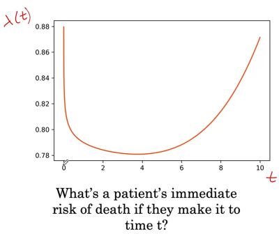

- The connection between the hazard and survival function
  - From hazard to survival
    $$
    \begin{aligned}
    \lambda(t) &= \dfrac{f(t)}{S(t)}\\
        &= \dfrac{f(t)}{1-F(t)} \\
        &= - \dfrac{\partial}{\partial t}\log[1-F(t)]\\
        &= - \dfrac{\partial}{\partial t}\log[S(t)]
    \end{aligned}
    $$
    Therefore,
    $$S(t) = \exp [-\int_0^t \lambda(u) du]$$
  
  - From survival to hazard
    $$\lambda(t) = \dfrac{f(t)}{S(t)} = -\dfrac{S'(t)}{S(t)} $$
    - By this formula, hazard can be interpreted as the rate of death if aged $t$.
  - Two example of hazard and survival curves

    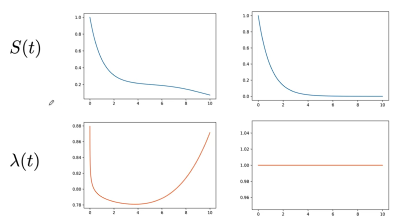

- Cumulative hazard
  - Cumulative hazard, denoted as $\Lambda(t)$, is a subject's accumulated hazard up to time $t$.
  - For discrete time intervals, $\Lambda(t) = \sum_{i=0}^t\lambda(i)$
  - For continuous time, $\Lambda(t) = \int_0^t \lambda(u) du$
  - Connection to the survival function
    $$S(t) = \exp[-\int_0^t \lambda(u)du] =\exp[-\Lambda(t)]$$
  

### 2.4.2. Customizing risk models to individual patients
- [Cox proportional hazards model](https://en.wikipedia.org/wiki/Proportional_hazards_model)
  - Enables individualized predictions taking into account subject's risk profile.
  - Baseline times individual factors 
    $$\lambda_{\text{individual}}(t) = \lambda_0(t)\times \text{factor} = \lambda_0(t)\exp[\sum_p \beta_p X_p]$$
  - Notice that when all covariables are zero, $\lambda_{\text{individual}}(t) = \lambda_0(t)$

- Ranking patients by risk
  - Given patient $i$'s risk $\lambda_0(t)\cdot C_i$, we can rank them by their risk
  - We don't need to know the baseline hazard $\lambda_0$ for ranking purpose, or to know the relative risk of individual subject compared to the baseline.

- Effect of weights on hazard
  - The individualized hazard model also lets us compare two individuals based on single covariables.
  - $\exp(\beta_i)$ is the risk increase for factor unit increase in variable $X_i$.
    - For discrete variable, e.g., smokers Vs non-smokers
      $$\dfrac{\lambda_{\text{smoker}}(t)}{\lambda_{\text{non-smoker}}(t)} = \dfrac{\lambda_0(t)\exp(\beta_{\text{smoke}}\times 1)\exp[...]}{\lambda_0(t)\exp(\beta_{\text{smoke}}\times 0)\exp[...]} = \exp(\beta_{\text{smoke}})$$
    - Similarly, for continuous variable, e.g., age
      $$\dfrac{\lambda_{\text{age}_1}(t)}{\lambda_{\text{age}_2}(t)} = \dfrac{\exp[\beta_{\text{age}}\times \text{age}_1]}{\exp[\beta_{\text{age}}\times \text{age}_2]} = \exp[\beta_{\text{age}}\times(\text{age}_1 - \text{age}_2)]$$

### 2.4.3. Non-linear risk models with survival trees
- Limitations of the Cox proportional hazards model
  - Unable to model non-linear relationship, e.g., high risk for young and old subjects while low risk for middle-aged subjects.
  - Assume that individualized risk curves are always proportional to each other, which is not always the case in reality. The graph below shows the risk difference between low-dosage versus high-dosage chemotherapy treatment.

    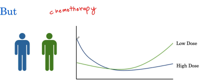

- Survival tree
  - Model the cumulative hazard $\Lambda(t)$ as a decision tree

    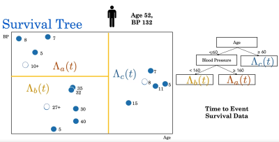
  
- [Nelson-Aalen estimator](https://en.wikipedia.org/wiki/Nelson%E2%80%93Aalen_estimator)
  - A non-parametric estimator of the cumulative hazard rate function in case of censored data or incomplete data.
  - The formula goes as follows
    $$H(t)=\sum_{t_i \leq t}\dfrac{d_i}{n_i}$$
  - Where $d_i$ is the number of subjects that died/failed at time $t_i$, $n_i$ is the number that survived to time $t_i$.
  - Recall that the survival function $S(t) = \exp[-\Lambda(t)]$, we can use Nelson-Aalen to estimate the survival function
    $$\hat{S}(t)=\exp[-\hat{H}(t)]$$

- Compare risks of subjects using mortality score
  - Mortality score is a single value that allows us to compare the accumulated risks across a set of event time for different patients/cumulative hazard functions. 
  - A simple approach is to use $\text{score} = \sum_{t\in T} \Lambda(t)$ where $T$ is a set of time that we are interested in (e.g., $T=[20, 25, 30, 35]$). We compare $\text{score}_a$ and $\text{score}_b$ for $\Lambda_a$ and $\Lambda_b$.

### 2.4.4. Evaluate survival models
- Recall that we can use C-index to evaluate prognostic models with binary outcomes
  $$\text{C-index}=\dfrac{\# \text{concordant pairs} + 0.5 \times \# \text{risk ties}}{\# \text{permissible pairs}}$$

- Survival models have two major differences compared with prognostic models, i.e., time to event and censoring. To cope with the differences, we modify the definitions used in the C-index as follows:
  - Concordant pairs
    - Two patients have the same negative outcome, if the patient has a lower time to event and a higher risk score, we consider it a concordant pair.
    - When their time to event are the same, and they have the same risk scores, it is also a concordant pair.
  - Risk tie
    - Risk tie now refers the pair with the same score but different time to event, or the same time to event but different risk scores.
  - Permissible pairs
    - Smaller and right-censored time to event in a pair makes it non-permissible, e.g., 20+ years versus 40 years.
    - If two time to event are the same but both right-censored, it is still non-permissible.
  
      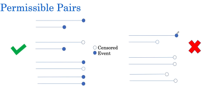

- With the modifications above, we can define the Harrell's C-Index using the same formula for evaluating prognostic models.

- An example of computing Harrell's C-Index is as follows:

  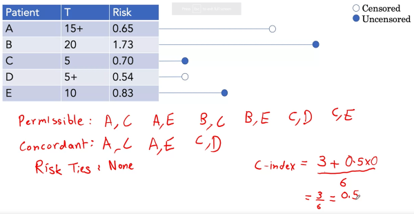

# Course 3: [AI for Medical Treatment](https://www.coursera.org/learn/ai-for-medical-treatment)

## 3.1. Treatment Effect Estimation
Key concepts
- Analyze data from a randomized control trial
- Interpreting Multivariate Models
- Evaluating Treatment Effect Models
- Interpreting ML models for Treatment Effect Estimation

### 3.1.1. Randomized Control Trials (RCT)
- Absolute risk reduction (**ARR**)
  - Treatment effect can be expressed as the difference between the absolute risks of the treatment and control group. 

- Randomized control trials
  - RCT is the setup of a medical experiment where subjects are randomly allocated to two or more groups, treated differently and compared with respect to a measured response.
  - $p$-value should also be reported, which can be interpreted as the likelihood of observing equal or greater effect between the treatment and control group while the true effect is zero.
  - $p$-value is a function of the number of subjects in each group.

- Number Needed to Treat (**NNT**) is the reciprocal of the ARR, which is the number of people who need to receive the treatment in order to benefit one of them.

### 3.1.2. Average Treatment Effect
- Causal inference
  - Potential outcomes of a treatment

    | Unit  | Outcome with treatment    | Outcome without treatment | Effect    |
    | :---: | ------------------------- | ------------------------- | --------- |
    |   1   | Doesn't have heart attack | Has heart attack          | Benefit   |
    |   2   | Has heart attack          | Has heart attack          | No effect |
    |   3   | Doesn't have heart attack | Doesn't have heart attack | No effect |
    |   4   | Has heart attack          | Doesn't have heart attack | Harm      |
  
  - Let "Doesn't have heart attack"=0 and "Has heart attack"=1, we can represent the table using [Neyman-Rubin causal model](https://en.wikipedia.org/wiki/Rubin_causal_model). Below is an example

    | Patient $i$ | $Y_i(1)$ | $Y_i(0)$ | $Y_i(1)-Y_i(0)$ |
    | :---------: | :------: | :------: | :-------------: |
    |      1      |    0     |    1     |       -1        |
    |      2      |    1     |    1     |        0        |
    |      3      |    1     |    0     |        1        |
    |      4      |    0     |    0     |        0        |
    |      5      |    0     |    1     |       -1        |
    |    Mean     |   0.4    |   0.6    |      -0.2       |

  - Average treatment effect 
    
    $$\mathbb{E}[Y_i(1)-Y_i(0)] = \mathbb{E}[Y_i(1)]-\mathbb{E}[Y_i(0)]$$
    
    as shown in the last row of the table above.
  
- Average treatment effect
  - The fundamental problem of causal inference is that we don't have the unobserved information / counterfactual.
  - In RCT however, we can estimate the average treatment effect by the following
    
    $$\mathbb{E}[Y_i(1)-Y_i(0)] = \mathbb{E}[Y_i|W=1]-\mathbb{E}[Y_i|W=0]$$

    where $W=1$ indicates the treatment group, and $W=0$ the control group.
  - Average treatment effect (ATE) is the negative of the average risk reduction (ARR).

- Conditional Average Treatment Effect (CATE)
  - Let $X$ be the feature vector of patients, i.e., $X=$[BP, Age, ...], the CATE can be estimated as follows
    
    $$\mathbb{E}[Y_i(1)-Y_i(0)|X=x]=\mathbb{E}[Y_i|W=1, X=x]-\mathbb{E}[Y_i|W=0, X=x]$$

  - The problem is that we might not have enough (or even at all) samples in the dataset that satisfies $[W\in \{1, 0\}, X=x]$. To address it, we can learn a **treatment response function** to represent the relationship between $[W, X]$  and $Y$, i.e.,
  
    $$\hat{\mathbb{E}}[Y_i(1)-Y_i(0)|X=x]=\hat{\mu}_{W=1}(x) - \hat{\mu}_{W=0}(x)$$

- T-learner
  - Use base learners to learn the response function

    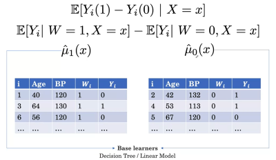

  - Train prognostic model as the base learner
  
    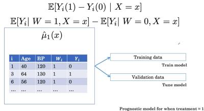

  - The method of using two tree-based models as base learners is called **T-Learner**, as an example shown below:
  
    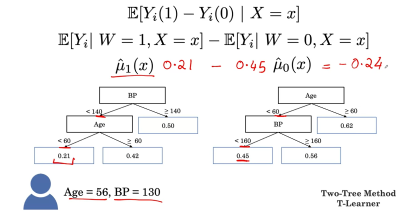

- S-learner
  - The Single-Tree Method (a.k.a S-Learner) uses a single model to estimate the response function by using the treatment indicator as a feature, i.e., $\hat{\mu}(x, w)$ instead of $\hat{\mu}_{W=1}$ and $\hat{\mu}_{W=0}$
  - The modeling scheme is as follows:
  
    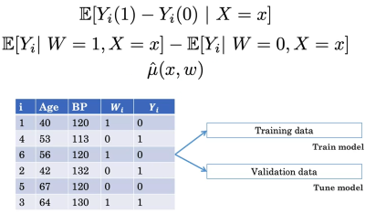

- Pros and Cons 
  - The disadvantage of S-learner is that the learned model might not use the treatment indicator feature at all, which estimates of treatment effect for all patients as zero.
  - The T-learner is less likely to have the "leaving treatment indicator out" problem, but since each learner uses about half the data for training, it might miss out on relationships between features.

### 3.1.3. Individualized Treatment Effect
- To evaluate an ITE estimate (say with treatment), we still need a proxy to the counterfactual for the subject of interest.
  - We can choose a match by finding someone like the patient without treatment.

  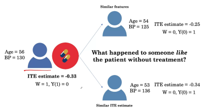

  - And then calculate the difference in treatment effect as the **Observed Benefit**.
  - Once we have a set of matched pairs and the corresponding observed benefits, we can evaluate whether higher predicted effect corresponds to a higher observed benefit.

- C-for-benefit (similar to C-index)
  - Concordant pair (of matched pairs) is when the higher estimate has higher outcome.
  - Not Concordant pair is when a higher estimate has lower outcome.
  - Risk tie is when we have the same effect estimate for different outcomes.
  - Tie in Outcome is when a pair has the same observed outcome
  - Permissible pairs are the ones with different observed outcomes.
  - With the notations above, the C-For-Benefit is defined as below 

  $$\text{C-For-Benefit} = \dfrac{\# \text{ concordant pairs} + 0.5\times \# \text{ risk ties}}{\# \text{ permissible pairs}}$$

- Interpretation of C-For-Benefit
  - $P(TE_A > TE_B | YD_A > YD_B)$, where $TE$ is the estimate of the difference in treatment effect, $YD$ is the outcome of the observed benefit.

## 3.2. Medical Question Answering
- Key concepts
  - Extracting disease labels from clinical reports
  - Question Answering with BERT

### 3.2.1. Question Answering

- Medical question answering
  - Schematics: Question $\rightarrow$ Search Engine $\rightarrow$ Passage $\rightarrow$ Answer
    - Use search engine to retrieve relevant passage
  
    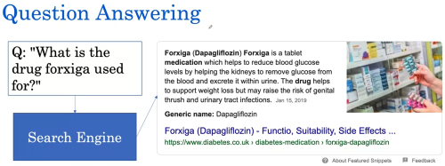

    - Use language model to generate answer

    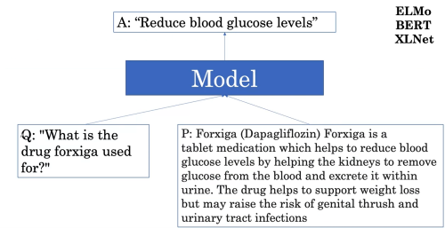

  - Use [BERT](https://en.wikipedia.org/wiki/BERT_(language_model)) as the language model
    - Feed tokenized question + passage as input
      
      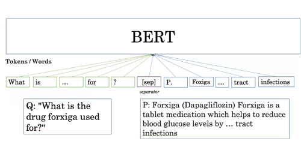
  
    - BERT consists of layers of transformer blocks
  
      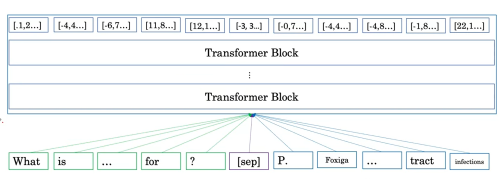

    - Word representation using embedding vectors
  
      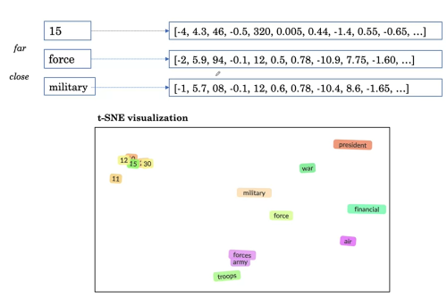

- Handling words with multiple meanings
  - Models like ELMo and BERT are able to incorporate context into word embeddings

    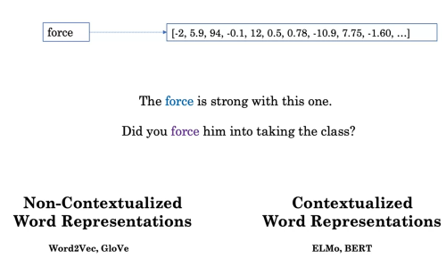

  - Learning to predict masked words in context

    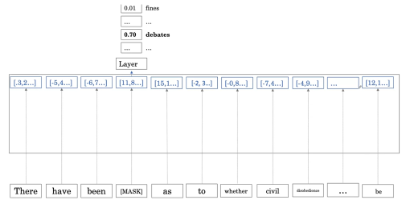

  - [BioBERT](https://arxiv.org/abs/1901.08746) is a extension of BERT trained on medical data.

- Define the answer in a text
  - Answer can be a segment of the passage
  - The model learns the probability of each of the words in the passage being the Start/End of the answer.
  
    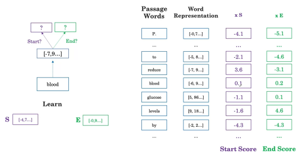

  - The output answer is the combination of words that has the highest added score
  
    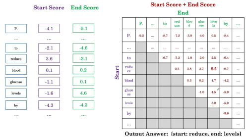

  - The model learns the $S$ and $E$ and updates its word representation by being shown many of the Q-P-A triplets.
    - Usually first trained on general domain dataset ([SQuAD](https://rajpurkar.github.io/SQuAD-explorer/)) and fine-tuned using biomedical datasets ([BioASQ](http://bioasq.org/)).

### 3.2.2. Automatic Labeling
- Automatic label extraction for medical imaging
  - We can use language models to automatically extract labels from medical reports (e.g., Radiology reports) for medical imaging tasks.
  
- Synonyms for labels
  - Use synonyms and terminologies such as [SNOMED CT](https://en.wikipedia.org/wiki/SNOMED_CT) to search the report for. 
  
- Is-a relationships
  - Terminology collections like SNOMED CT contains Synonyms, and Is-A relationships to concepts, e.g., 
    - Viral pneumonia *IS-A* Infectious pneumonia
    - Infectious pneumonia *IS-A* Pneumonia
    - Pneumonia *IS-A* Lung disease
  - We can use the relevant Is-A relationships to define rule-based strategy to determine the label.

- Presence or absence of a disease
  - Also need to take into account whether the observation is present or absent.
  - We can use Regex Rules, [Dependency Parse Rules](https://en.wikipedia.org/wiki/Dependency_grammar), or Negation Classification.
  - An example is as follows:

      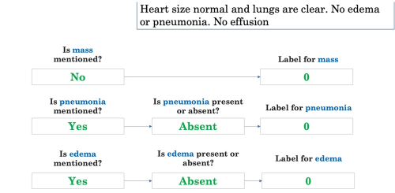

### 3.2.3. Evaluate Automatic Labeling
- Evaluating label extraction
  - Ways to get the ground truth
    - Human annotation from radiology report
    - Human annotation from image
- Precision and recall and F1 score
  - How good is the labeler on each of the labels (e.g., Mass, Pneumonia, Edema)
  - We can use Precision/Recall/F1-score to evaluate the performance on each diseases.
- Evaluating on multiple disease categories
  - Option 1 (*Macro-average*): compute performance measure for each class and average
  - Option 2 (*Micro-average*): calculate the performance measure globally

## 3.3. ML Interpretation
- Key concepts
  - Interpreting Deep Learning Models
  - Feature Importance in Machine Learning

### 3.3.1. Feature Importance
- Drop column method
  - Measure the importance of a feature by the performance difference between the new model trained on the sample with that feature removed and the original model.
  - The method can get computationally expensive when the total number of features is large.
  
- Permutation method
  - Use the performance difference between the model score evaluated on the dataset with the feature of interest permuted/shuffled and on the original dataset.
  - The method does not require re-training of the model.
  - [Permutation feature importance](https://scikit-learn.org/stable/modules/permutation_importance.html#permutation-importance) from `scikit-learn` user's guide.

### 3.3.2. Individual Feature Importance
- Individual feature importance
  - Similar to the drop-column method, we can look at the model output difference (instead of performance metric) with feature(s) of interest removed.
  - The disadvantage is that the importance measure can be misleading when features are correlated.
- Shapley values
  - Look at feature coalitions instead of single feature's impact on model output.
- Shapley values for all patients
  - Summary plot and dependence plot can provide global importance interpretation.
  - Check the [`shap`](https://github.com/slundberg/shap) package for more details.

### 3.3.3. Interpreting Deep Learning Models
- Interpreting CNN models
  - Use Grad-CAM to generate heatmap that shows part of the image that is the most indicative of the prediction.

    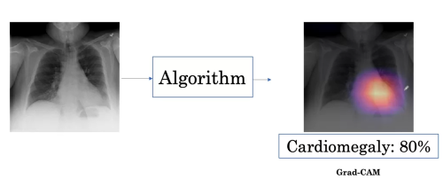

- Localization maps
  - Use spatial maps (typically output of last conv layers) 
  
    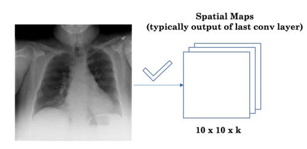

  - Use weighted-average of the spatial map to generate the final localization map
  
    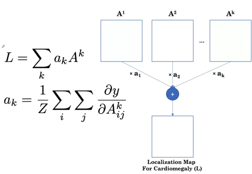

- Heat maps
  - Another modification needed is to apply a ReLU function to the activation (since we care more about positive impact), and then use a color map to convert numerical values to a heatmap. 
  - Finally the heatmap is resized with interpolation to scale up from the size of the spatial map to the X-Ray image, and made transparent and overlaid with the original image.

    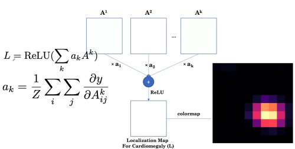

  - For multi-class problem, we can generate heatmaps for each particular class.

## 3.4. Citations
- Week 1
  - Levamisole and fluororacil background: https://www.nejm.org/doi/full/10.1056/NEJM199002083220602
  - Data sourced from here: https://www.rdocumentation.org/packages/survival/versions/3.1-8/topics/colon
  - C-statistic for benefit: https://www.ncbi.nlm.nih.gov/pubmed/29132832
  - T-learner: https://arxiv.org/pdf/1706.03461.pdf
- Week 2
  - Grad cam: https://arxiv.org/pdf/1610.02391.pdf
  - Random forests + permutation importance: https://www.stat.berkeley.edu/~breiman/randomforest2001.pdf (R45f14345c000-1 Breiman, “Random Forests”, Machine Learning, 45(1), 5-32, 2001.)
  - Shapley importance: https://www.nature.com/articles/s42256-019-0138-9
- Week 3
  - Labeling methods and dataset: https://arxiv.org/abs/1901.07031
  - Huggingface transformers library: https://github.com/huggingface/transformers
  - BERT paper: https://arxiv.org/abs/1810.04805
  - Question answering data set (used for example): https://rajpurkar.github.io/SQuAD-explorer/
  - Clinical note example for question answering: https://www.mtsamples.com/

