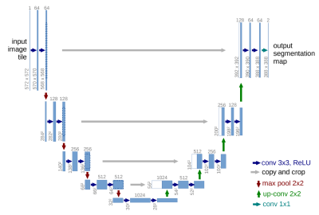

Notes on some of the recommended readings from the specialization.

### [Grad-CAM: Visual Explanations from Deep Networks via Gradient-based Localization](https://arxiv.org/pdf/1610.02391.pdf)

### [U-Net: Convolutional Networks for Biomedical Image Segmentation](https://arxiv.org/pdf/1505.04597.pdf)

- Materials
  - [Authors' website](https://lmb.informatik.uni-freiburg.de/people/ronneber/u-net/)
  - Heet Sankesara's [U-Net article](https://towardsdatascience.com/u-net-b229b32b4a71) contains PyTorch and Tensorflow implementations.
- Technical notes
  - Architecture
  
     
    
    - **Contraction**: blocks of 3x3 conv. layers followed by 2x2 max pooling, with the number of feature maps doubles after each block to increase "what" (complex structure) and reduce "where".
    - **Bottleneck**: mediates between the contraction and expansion layers.
    - **Expansion**: blocks of 3x3 conv. layers followed by 2x2 up-sampling layers, with the number of feature maps halved after each block to maintain symmetry (for concatenation).
  - Transposed convolution (up-sampling)
    - A *transposed convolution* is a convolution where the implementation of the forward and backward passes are swapped to achieve effective up-sampling. It is commonly used in semantic segmentation tasks which requires to predict values for each pixel.
    - See [slides](https://glouppe.github.io/info8010-deep-learning/?p=lecture4.md#45) from INFO8010 deep learning course, and the tutorial [A guide to convolution arithmetic for deep learning](https://arxiv.org/abs/1603.07285) for details.
  - Loss function
    - Pixel-wise soft-max over the final feature map combined with cross entropy.
  - The U-Net paper uses *warping error* for evaluation.
    - The warping error between two segmentations is the minimum mean square error between the pixels of the target segmentation and the pixels of a topology-preserving warped source segmentation.
    - Mathematically, warping error is defined as $D(T||L^*) = \min_{L <| L^*} ||T-L||^2$, where $L^*$ is the ground truth labeling, $T$ is a candidate labeling, and $L$ is any warping of $L^*$. 
    - See article [Segmentation Metrics](https://ashm8206.github.io/2018/04/08/Segmentation-Metrics.html) for details about Pixel/Warping/Rand errors.